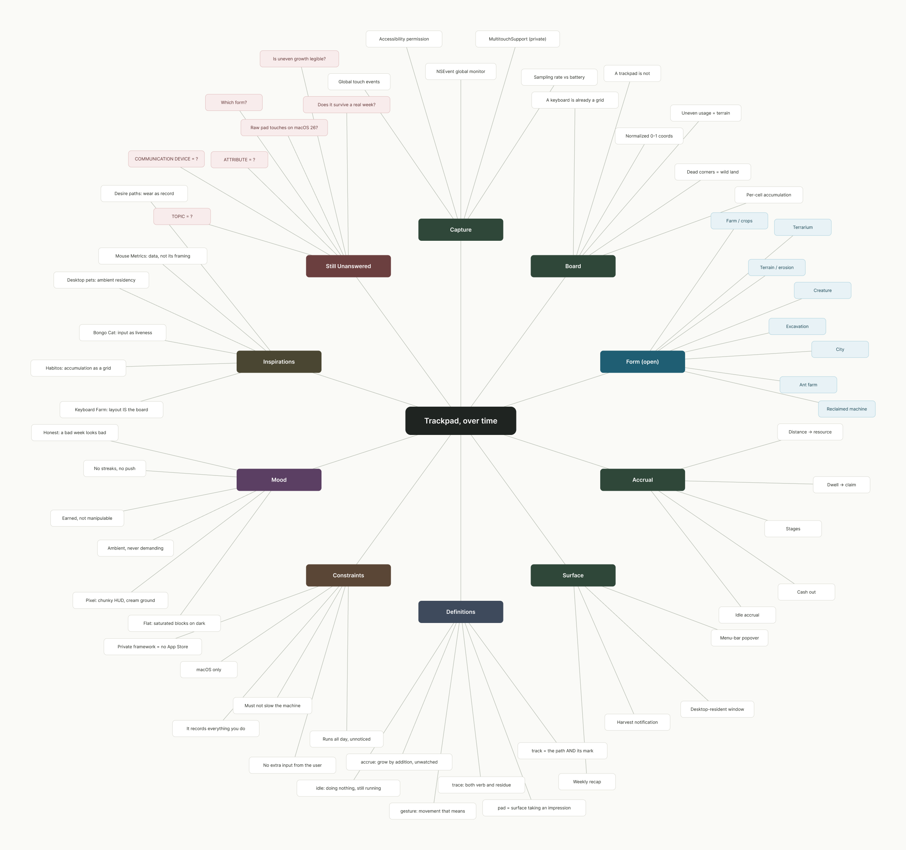
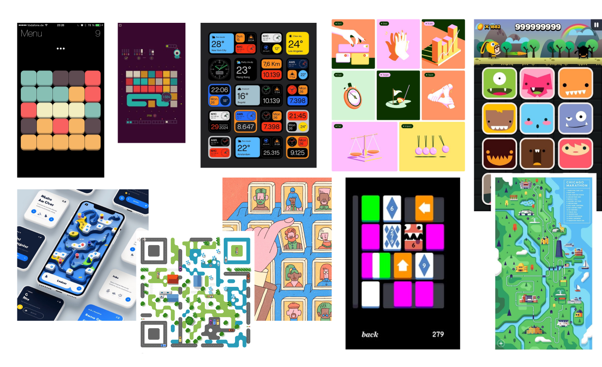
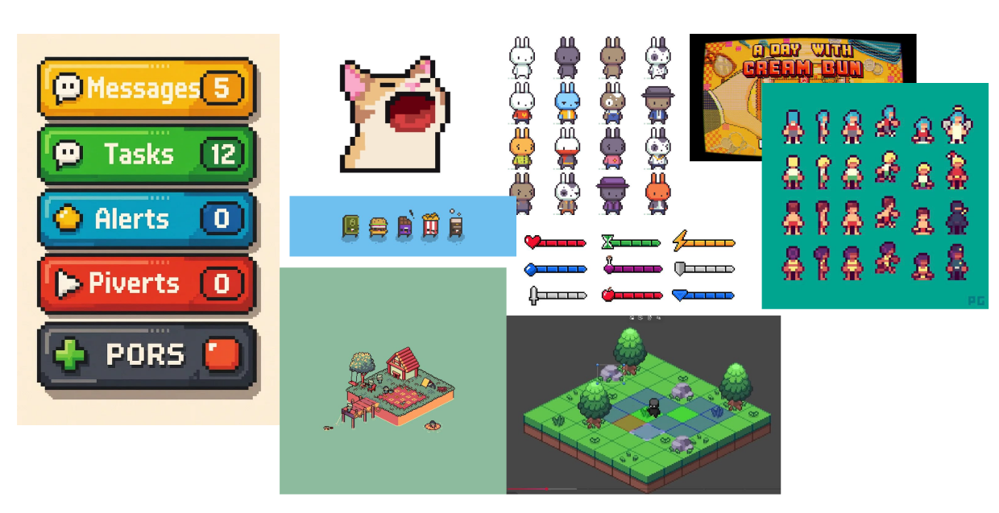

# Week 2 — Mind map and moodboards

My project records what your trackpad accumulates: where your finger actually
goes, how far it travels, which corners it never touches. Something grows out of
that while you work. You don't play it. You've already played it.

## Mind map

There are ten branches. Four of them are things I have to build, three are
things I have to decide, one is what I'm borrowing from, one is what's limiting
me, and the last one is just the list of things I can't answer yet.

Two things came out of making it.

The first is that a keyboard is already a grid and a trackpad is not. Keyboard
Farm works because a keyboard hands you the board for free: about a hundred
fixed, named tiles, so `J` is always in the same place and a plant on `J` is
legible. A trackpad has no landmarks and no discrete events, which means
"record the trajectory" doesn't automatically give you anything you can look at.
That's the actual problem, and I didn't see it until the branch made me write
both lines next to each other.

The second came out of a Definitions branch I added because I was stuck. *Track*
means the path you take and also the mark that path leaves; *trace* is both the
verb and the residue. The premise of the project is sitting inside the name of
the device.

There are dead branches on the map and I left them there.

## Moodboards

I made two, and they turned out to be two visual languages rather than two
moods.

The first one is flat and modern

The second is pixel and retro

## Two ways to develop it

By topic there are three directions I could push: unconscious labour, wear as a
record, and company.

By attribute there are four things it has to be. It has to be ambient, so if it
ever needs my attention it's broken. It has to be earned, so grinding on purpose
should feel stupid. It has to be honest, so a week where I barely used the
machine should look like that week. And it shouldn't have streaks or
notifications.

I'd push attribute first, because earned and honest kill most of the candidate
forms on their own. A farm with a harvest button rewards grinding, and I'd
rather find that out now than after I've drawn it.

## Still open

Topic, communication device and attribute are all still question marks on the
map, and so is which form this takes. The other open one is whether I can read
raw trackpad touches on macOS 26 without a private framework.

## Questions

Would you want a thing like this to look like a toy or an instrument? I can't
tell which is better.

Is there a version of this that isn't cute? Everything I'm drawn to is cosy and
I'm suspicious of that.
